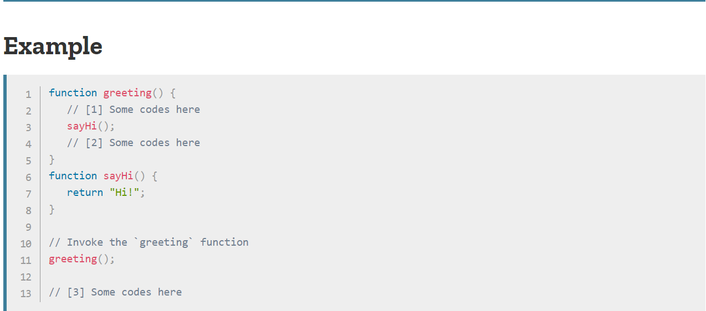

## 호출 스택(Call Stack)

Call Stack은 자바스크립트에서 함수를 처리하는 핸들 중 하나입니다.<br>
아래의 첨부사진을 활용하면서 설명하겠습니다 :)<br>

<br>

위와 같은 자바스크립트 코드가 있습니다. 브라우저는 스크립트를 읽어올 때 아래와 같은 방식으로 동작합니다.<br>

1. 브라우저는 모든 함수들을 무시하고 함수를 호출하는 greeting()함수를 찾습니다.

2. greeting()호출 함수를 찾는 즉시 Call Stack List에 추가합니다.

   ```
   Call Stack List:
   - greeting()
   ```

3. 추가한 후 greeting함수의 코드를 위에서 아래로 차례대로 실행합니다.[1]

4. greeting함수의 코드를 차례대로 실행하다 sayHi()호출 함수를 만났습니다.

5. sayHi()호출 함수를 만나는 즉시 Call Stack List에 추가합니다.

   ```
   Call Stack List:
   - sayHi()
   - greeting()
   ```

6. sayHi()함수의 모든 코드가 실행이 끝날 때까지 기다립니다.

7. sayHi()함수가 return을 반환하면 greeting()함수의 남은 코드[2]를 실행합니다.

8. sayHi()함수를 Call Stack List에서 삭제합니다.

   ```
   Call Stack List:
   - greeting()
   ```

9. greeting()함수의 남은 코드가 마저 실행되고 return(생략)이 반환되면 [3]번으로 이동해 나머지 코드를 실행합니다.

10. greeting()함수를 Call Stack List에서 삭제하고 마무리 됩니다.
    ```
    Call Stack List:
    EMPTY
    ```

요약을 하자면, 처음에는 스크립트가 비어있는 상태에서 함수 호출을 하는 즉시 자동적으로 콜스택에 추가를 하고 그 함수의 모든 코드가 실행이 완료되면 자동적으로 콜스택에서 삭제되는 것입니다. 최종적으로 콜스택은 비어있는 상태가 되는 것이죠!

---

이 MD는 밑의 글과 영상을 참고하여 만들었습니다 :)

### Written

- 📜 [Call Stack — MDN](https://developer.mozilla.org/en-US/docs/Glossary/Call_stack)

### Video

Nothing
