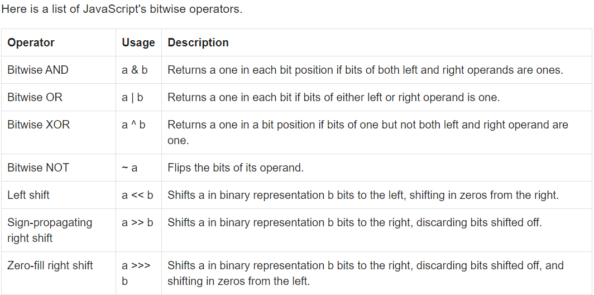

## 비트 연산자, 형식화 배열, 버퍼(배열)

이 Concept은 비트 연산자에 대해 다루고 있습니다.<br>

비트 연산자는 무엇인가요?<br>
비트 연산자는 변수가 bit level과 상호작용할 수 있는 유일한 방법입니다.<br>
비트는 0과 1로 이루어져 있어 하드웨어가 이해할 수 있는 근접한 표현입니다.<br>

```
우리가 컴퓨터에서 사용하는 문자열이나 숫자 등이 사실은
01010100110110 이런 표현 방식으로 컴파일 되어 컴퓨터가 이해하게 되는
것 입니다.

1 (integer) = 0001 (binary)
2 = 0010
3 = 0011
4 = 0100
5 = 0101
6 = 0110
7 = 0111
8 = 1000
```

비트 연산자는 일반 논리 연산자와 비교할 수 있습니다.<br>

```
3 & 6
vs
3 && 6

위의 두 코드는 어떤 차이가 있을까요?
```

위의 코드는 비트 연산자를 사용했고 아래 코드는 일반 논리 연산자를 사용한 것 입니다.<br>

```
비트 연산자는 숫자를 비트 레벨로 바꾸어 인식하고 0 과 1로 이루어진 연산을 합니다.
0011
0110

0010
둘 다 1이면 1이나오는 & 연산을 통해 결과는 2가 나오게 됩니다.
```

```
일반 논리 연산자는 true인지 false인지 확인을 하게 되는데
둘 다 참이면 오른쪽에 있는 값을 출력하게 됩니다.
따라서 3 && 6 은 6이라는 결과를 나타냅니다.
```

비트 연산자에 대한 건 아래를 참고 하시길 바랍니다 :)<br>
<br>

---

이 MD는 밑의 글과 영상을 참고하여 만들었습니다 :)

### Written

- 📜 [Bitwise Operators in Javascript — Joe Cha](https://medium.com/bother7-blog/bitwise-operators-in-javascript-65c4c69be0d3)

- 📜 [JavaScript Bitwise Operators — w3resource](https://www.w3resource.com/javascript/operators/bitwise-operator.php)

### Video

Nothing
