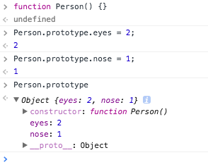

## 프로토타입의 상속과 체인

이 Concept은 프로토타입에 관해서 다루고 있습니다 :)<br>

이번 컨셉은 `Prototype`에 대해서 알아보겠습니다.<br>
필자는 Prototype이 무엇인지 이 Concept을 다루면서 처음 알았습니다 ㅠㅠ<br>

자바스크립트는 프로토타입 기반 언어라고 불릴 정도로 프로토타입의 개념이 중요하다고 합니다..(난 왜 처음 알았지?;;)<br>

또한 자바스크립트는 다른 언어들과 마찬가지로 객체지향 프로그래밍 언어라고도 불리는데요.<br>
중요한 것은 다른 언어(C, JAVA, Python)등은 클래스를 사용해 객체를 찍어내지만 자바스크립트에는 클래스라는 것이 없습니다.<br>
따라서 자바스크립트는 프로토타입을 이용해 이와 비슷하게 객체를 생성합니다.<br>

자바스크립트에 클래스가 왜 없냐? 라고도 하실 수 있는데<br>
자바스크립트에서 클래스는 최근에 ES6문법에 추가됨으로서 아직은 자바스크립트가 클래스 기반으로 사용되고 있지 않습니다.<br>

자바스크립트에는 클래스는 없지만 비슷하게 사용하는 방법이 하나 있습니다.<br>

```
function Person() {
  this.eyes = 2;
  this.nose = 1;
}

let kim  = new Person();
let park = new Person();

console.log(kim.eyes);  // => 2
console.log(kim.nose);  // => 1
console.log(park.eyes); // => 2
console.log(park.nose); // => 1
```

위 코드는 지난 Concept에서 많이 다뤘던 Factory Function입니다.<br>
이렇게 객체를 생성하면 발생하는 일은 kim과 park 객체의 eyes와 nose 두 개의 변수를 가지고 있으므로 메모리에는 총 4개가 할당되게 됩니다.<br>
만약 100개의 객체를 생성하게 되면 200개의 변수가 메모리에 할당되는 것이죠.<br>
이러한 문제를 Prototype을 사용해 해결할 수 있습니다.<br>

```
function Person() {}

Person.prototype.eyes = 2;
Person.prototype.nose = 1;

var kim  = new Person();
var park = new Person();

console.log(kim.eyes); // => 2
```

위의 코드를 간다히 설명하자면 Person.prototype이라는 빈 객체가 어딘가에 존재하고 Person 함수로부터 생성된 객체 kim & park는 앞에 있는 빈 객체에 있는 값들을 참조할 수 있습니다.<br>
이 말이 무슨 말인지 처음에는 이해하기 어렵습니다.<br>
따라서 그림을 보면서 이해를 돕도록 합시다!<br>

그림을 보기 전에 먼저 `Prototype Lin`k와 `Prototype Object`를 다뤄보겠습니다.<br>
자바스크립트에는 Prototype Link 와 Prototype Object라는 것이 존재합니다. 그리고 이 둘을 통틀어 Prototype이라고 부릅니다.<br>

먼저 'Prototype Object'에 대해 설명하겠습니다.<br>

우리는 함수를 정의할 때 눈에 보이지 않지만 2가지 일이 뒤에서 일어납니다.<br>

1. 해당 함수에 Constructor(생성자) 자격 부여
   Class에도 Constructor가 있는 것을 보신 적이 있을 겁니다.<br>
   이것이 하는 역할은 Constructor가 있어야만 new 생성자로 객체를 만들어 낼 수 있습니다.<br>
   보이지는 않지만 함수가 생성되면 Constructor가 어딘가엔 생성이 되어 있는 것 입니다.<br>
   이것은 함수에만 해당이 되며 객체에서는 일어나지 않습니다. 아래와 같이 말이죠.<br>

   ```
   const obj = {};

   const a = new obj();

   result

   Error: obj is not constructor...
   ```

2. 해당 함수의 Prototype Object 생성 및 연결
   함수를 정의하면 함수만 생성되는 것이 아니라 Prototype Object도 같이 생성이 됩니다.<br>
   아래 그림을 참고하시길 바랍니다.<br>
   <br>
   아래와 같이 함수가 생성이 되면 보이지 않는 곳 어딘가에 `Person Prototype Object(객체)`를 하나 생성합니다.<br>
   그리고 생성된 함수는 `prototype`이라는 속성을 통해 Prototype Object에 접근할 수 있습니다. Prototype Object는 일반적인 객체와 같으며 기본적인 속성으로 `constructor`와 `__proto__`를 가지고 있습니다.<br>
   constructor는 Prototype Object와 같이 생성되었던 함수를 가리키고 있습니다. **proto**는 Prototype Link입니다. 밑에서 다시 설명하고 먼저 Prototype Object에 대해 이야기 해보겠습니다.<br>

   ```
   function Person() {}

   Person.prototype.eyes = 2;
   Person.prototype.nose = 1;

   var kim  = new Person();
   var park = new Person():
   console.log(kim.eyes); // => 2

   위 결과는 어떻게 될까요?
   ```

   <br>
   Person.prototype은 Person Prototype Object를 가리키기(참조하기)때문에 kim & park 객체는 eyes와 nose 변수를 가지지 않고 Person Prototype Object의 값을 참조해서 eyes와 nose 값을 사용할 수 있게 됩니다!<br>

   다음으로 'Prototype Link'에 대해서 설명해보겠습니다.<br>
   <br>
   kim에는 eyes라는 속성이 없는데도 kim.eyes를 실행하면 2라는 값을 참조하는 것을 볼 수 있습니다. 위에서 설명했듯이 Prototype Object에 존재하는 eyes 속성을 참조한 것인데요, 이게 어떻게 가능한걸까요??<br>
   바로 kim이 가지고 있는 딱 하나의 속성 `__proto__`가 그것을 가능하게 해주는 열쇠입니다.<br>
   prototype 속성은 함수만 가지고 있던 것과는 달리 **proto**속성은 모든 객체가 빠짐없이 가지고 있는 속성입니다.<br>
   **proto**는 객체가 생성될 때 조상이었던 함수의 Prototype Object를 가리킵니다. kim객체는 Person함수로부터 생성되었으니 Person 함수의 Prototype Object를 가리키고 있는 것이죠.<br>
   아래 그림과 같이 말입니다.<br>
   <br>
   위 그림은 모든 것을 설명해줍니다.<br>
   함수 Person이 생성되면 보이지않는 prototype(Person Prototype Object를 참조)를 가지고<br>
   함수 Person은 또한 보이지 않는 Person Prototype Object를 생성합니다.<br>
   Person Prototype Objects는 보이지 않는 변수로 construtor(function Person을 참조) 그리고 **proto**를 가지고 있습니다.<br>
   new 생성자로 생성된 객체 kim도 객체이기 때문에 모두 갖는 **proto**변수를 가지고 이 변수는 바로 객체가 생성될 때 조상이었던 함수의 Prototype Object를 가리킵니다.<br>
   때문에 위와 같이 Person Prototype Object를 가리키는 것이죠!<br>

   <br>
   kim객체가 eyes를 직접 가지고 있지 않기 때문에 eyes 속성을 찾을 때 까지 상위 프로토타입을 탐색합니다.<br>
   최상위인 Object의 Prototype Object까지 도달했는데도 못찾았을 경우 undefined를 리턴합니다.<br>
   이렇게 **proto**속성을 통해 상위 프로토타입과 연결되어있는 형태를 프로토타입 체인(Chain)이라고 합니다.<br>
   이런 프로토타입 체인 구조 때문에 모든 객체는 Object의 자식이라고 불리고, Object Prototype Object에 있는 모든 속성을 사용할 수 있습니다.<br>

이번 Concept은 여기서 마무리 입니다 :)<br>
문서가 많이 어렵고 난해해서 어느 한 개발블로그를 참고했습니다.<br>
이해가 잘 가지 않으신다면 밑의 링크를 참고하시길 바라겠습니다.<br>

---

### Written

- 📜 [Javascript 프로토타입 이해하기](https://medium.com/@bluesh55/javascript-prototype-%EC%9D%B4%ED%95%B4%ED%95%98%EA%B8%B0-f8e67c286b67)

### Video

Nothing
