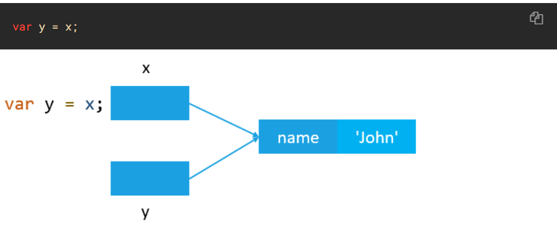

## 값 타입(Value Type)과 참조 타입(Reference Type)

이번에 다룰 Concept는 매우 흥미로운 내용이다.<br>
컨셉을 다루기전에 먼저 밑의 코드를 보면서 생각해보는 시간을 가져봅시다.<br>

```
console.log([10] === [10]);
console.log({'a': 20} === {'a': 20});
```

위 코드를 보면서 결과를 어떻게 도출하셨나요?<br>
true라고 생각하시는 분들도 계실테고 false라고 생각하시는 분들도 계실 것 같습니다.<br>
저는 처음에 당연히 true가 나와야 정상 아니야?... 라고 생각했지만!<br>
결과는 false false 입니다.<br>

이 컨셉에 대해 설명을 시작하겠습니다 :)

지난 강의에서 Primitive Type에 대해서 다뤘습니다. 이것은 변경될 수 없는 값을 가지며 String, Number, Boolean, NaN, Infinite, null, undefined 등의 타입을 가집니다.<br>
즉, 값을 가진다는 말인데요! 이것은 아래에서 이렇게 적용이 될 수 있습니다.
```
let a = 1;
let b = a;

a = 2;

console.log(b);
```
이 코드에서 콘솔로그가 출력하는 b값은 1입니다.<br>
그 이유는 a도 값을 가지며 b도 a값을 복사하기 때문인데요. b는 중간에 a값(1)을 물려받지만 a는 마지막에 2값을 선언하기 때문에 최종적으로는
`a = 2, b = 1`이라는 결론을 도출할 수 있습니다.<br>

그렇다면 아래에 있는 코드는 결과가 어떻게 나올까요?<br>
```
const x = ['1', '2'];
const y = x;

x.push('3');

console.log(y);
```
위에서 말한 개념을 가지고 결과를 생각해본다고 가정하면 콘솔로그에서 x가 나와야 하는 값은 `['1', '2']`가 나와야 합니다.<br>
하지만 이 코드의 결과는 `['1', '2', '3']`이 나오게 됩니다.<br>

그 이유는 x와 y는 Value Type이 아닌 Reference Type이기 때문인데요 ㅋ.ㅋ<br>
Value Type은 자신만의 값을 가지고 있는 반면에 Reference Type은 아래 첨부사진과 같이 메모리 상에 있는 어떤 `ref`를 가리키게 됩니다.<br>

<br>

보는 바와 같이 값을 복사하는 것이 아니라 어떠한 `ref`를 가리키게 됩니다.<br>
때문에 x배열에 3값을 집어넣었지만 y배열에서도 x배열이 갖고 있는 `ref`를 가리키기 때문에 `['1', '2' '3']`이라는 결과가 나오게 되는 것 입니다.<br>

Value Type을 가질 수 있는 것들 -> `String, Number, Boolean, NaN, Infinite, null, undefined`<br>
Reference Type을 가질 수 있는 것들 -> `Array, Object, 일부 Function`등이 있습니다.<br>
구별하는 것이 가능하다면 나중에 오류가 발생해도 어디서 값이 잘못된 것인지 쉽게 알 수 있는 좋은 컨셉이라고 생각합니다 :)

---

이 MD는 밑의 글과 영상을 참고하여 만들었습니다 :)

### Written

- 📜 [JavaScript Primitive vs Reference Values](https://www.javascripttutorial.net/javascript-primitive-vs-reference-values/)

### Video

Nothing