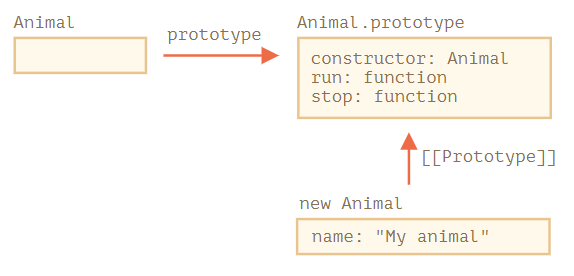
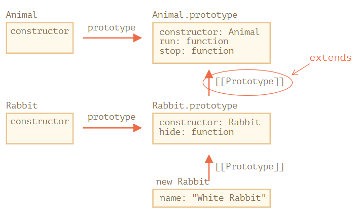

## 상속, 다형성, 코드의 재사용성

이번 Concept은 상속과 다형성 그리고 코드의 재사용성에 대해서 이야기 해보겠습니다.<br>

---

### 상속

상속은 부모가 자식에게 무엇인가 물려줄 때 사용되는 말입니다.<br>
클래스 상속은 한 클래스가 다른 클래스를 상속하는 방법으로 기존 기능 위에 새로운 기능을 만들 수 있습니다.<br>

클래스가 있다고 가정해 봅시다.<br>

```
class Animal {
  constructor(name) {
    this.speed = 0;
    this.name = name;
  }
  run(speed) {
    this.speed = speed;
    alert(`${this.name} runs with speed ${this.speed}.`);
  }
  stop() {
    this.speed = 0;
    alert(`${this.name} stands still.`);
  }
}

let animal = new Animal("My animal");
```

animal객체와 Animal클래스를 그래픽으로 표현하는 방법은 다음과 같습니다 .<br><br>
<br>

여기서 우리는 'Rabbit' 클래스를 하나 더 만들려고 합니다.<br>
Rabbit은 또한 'Animal'이므로 당연히 동물이 할 수 있는 것은 다 할 수 있습니다.<br>

클래스를 확장하는 방법은 다음과 같습니다 -> `class Child extends Parent`<br>

```
class Rabbit extends Animal {
  hide() {
    alert(`${this.name} hides!`);
  }
}

let rabbit = new Rabbit("White Rabbit");

rabbit.run(5); // White Rabbit runs with speed 5.
rabbit.hide(); // White Rabbit hides!
```

즉, 토끼 객체는 아래 그림과 같이 상속됩니다.<br><br>
<br>

위 코드에서 알 수 있는 것은 rabbit은 run()메서드가 없습니다.<br>
하지만 rabbit은 run()메서드를 사용할 수 있습니다. 아래와 같은 방법으로!<br>
`1️⃣rabbit은 run()메서드가 없습니다.`<br>
`2️⃣rabbit은 상속된 프로토타입으(Rabbit.prototype)로 찾아가 run()메서드를 찾지만 hide()메서드 밖에 없습니다.`<br>
`3️⃣rabbit은프로토타입의 프로토타입인 Animal.prototype에 run()메서드를 사용할 수 있게 됩니다. `<br>

rabbit 객체는 run메서드가 업지만 프로토타입 체인에서 위에 있는 프로토타입에서 run()메서드를 찾아 사용할 수 있게 된 것 입니다.<br>
이처럼 부모가 run()메서드를 물려주는 듯한 행위를 `상속`이라고 합니다.<br>

### 다형성

다형성은 미리 만들어둔 기능을 다시 입맛에 맞게 바꾸어 사용하는 것을 말합니다.<br>

```
class Animal {

  constructor(name) {
    this.speed = 0;
    this.name = name;
  }

  run(speed) {
    this.speed = speed;
    alert(`${this.name} runs with speed ${this.speed}.`);
  }

  stop() {
    this.speed = 0;
    alert(`${this.name} stands still.`);
  }

}

class Rabbit extends Animal {
  hide() {
    alert(`${this.name} hides!`);
  }

  stop() {
    super.stop(); // call parent stop
    this.hide(); // and then hide
  }
}

let rabbit = new Rabbit("White Rabbit");

rabbit.run(5); // White Rabbit runs with speed 5.
rabbit.stop(); // White Rabbit stands still. White rabbit hides!
```

만약 동물이 하는 멈춘다라는 메서드를 정의했는데 어느 한 동물만 멈추는 동작이 다르다면?<br>
보는 것과 같이 Animal 클래스에도 stop() 메서드가 있지만 Rabbit 클래스에도 stop() 메서드를 마음대로 다시 재선언했습니다.<br>
rabbit 클래스는 animal 클래스의 stop() 메서드를 사용하는 것이 아닌 자기 자신의 stop() 메서드를 사용하는 것 입니다.<br>
이렇게 부모에서 선언한 것을 자식이 자신의 원하는 형태로 바꾸어 사용하는 것을 `override`라고 합니다.<br>

만약 rabbit 객체가 animal클래스의 stop() 메서드를 사용하고 싶다면 `super`키워드를 사용해 animal 클래스의 stop() 메서드를 사용할 수 있습니다.<br>

---

### Written

- 📜 [Inheritance in JavaScript — MDN](https://javascript.info/class-inheritance)

### Video

Nothing
